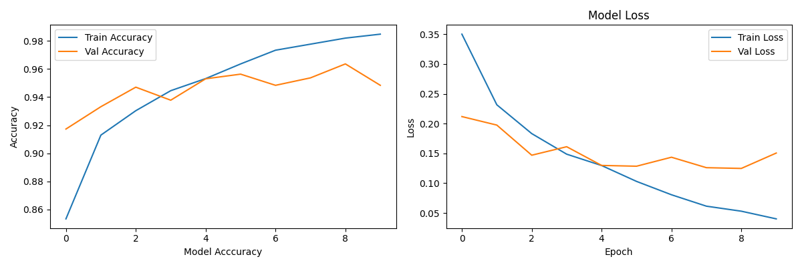
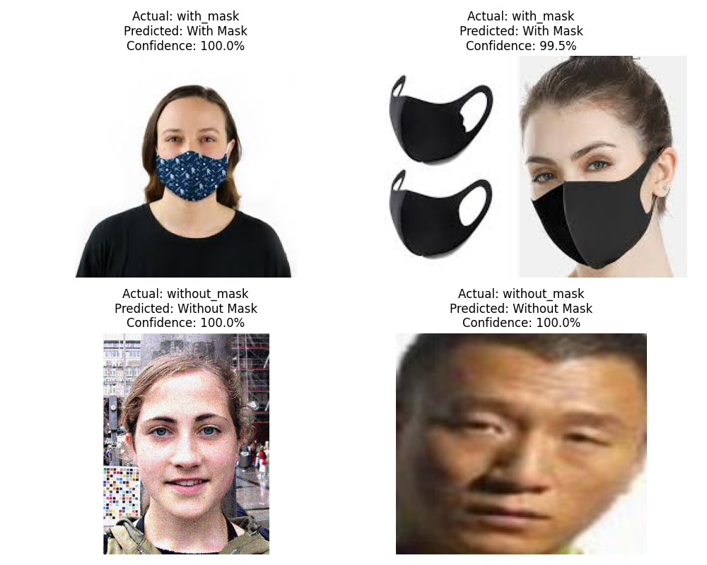

# Face Mask Detection using CNN & OpenCV

## Overview

A deep learning project that detects whether a person
is wearing a face mask or not using a CNN model built
with TensorFlow/Keras and real-time detection using OpenCV.

## Tech Stack

- Python
- TensorFlow / Keras
- OpenCV
- NumPy
- Matplotlib

## Model Performance

- Training Accuracy: 97.7%
- Validation Accuracy: 95.2%
- Dataset: 7553 images (3725 with mask, 3828 without mask)

## How to Run

### Train the model:

Open and run all cells in:
Face_Mask_Detection.ipynb

### Real-time webcam detection:

cd Face_Mask_Detection
python webcam_detection.py
Press Q to quit

## Results

## Dataset

[Face Mask Dataset - Kaggle](https://www.kaggle.com/datasets/omkargurav/face-mask-dataset)

## Notes

- Model performs best on clear frontal face images
- Performance may vary on cropped or side profile images

## Author

Contributed as part of GirlScript Summer of Code 2026 (GSSoC'26)
